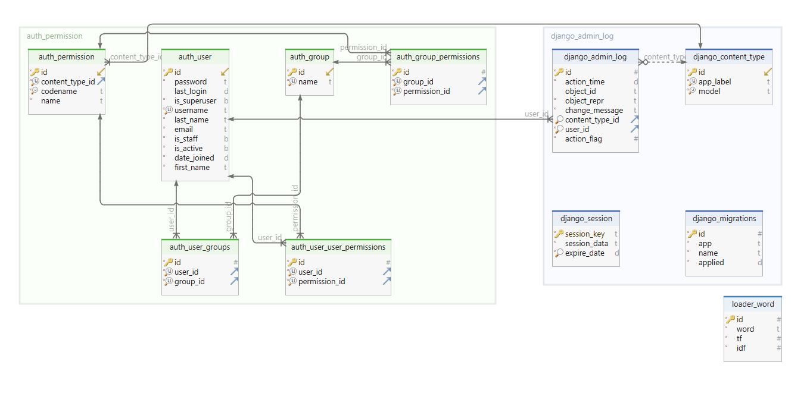

## Развёртывание проекта:
+ Клонировать репозиторий и перейти в него в командной строке:
```shell script
git clone git@github.com:Furturnax/tfidf.git
```

```shell script
cd tfidf/
```

+ Cоздать и активировать виртуальное окружение (Windows/Bash):
```shell script
python -m venv venv
```

```shell script
source venv/Scripts/activate
```

+ Установить зависимости из файла requirements.txt:
```shell script
python -m pip install --upgrade pip
```

```shell script
pip install -r requirements.txt
```

+ Выполнить миграции:
```shell script
python manage.py migrate
```

+ Создать файл .env c переменными окружения:

[Руководство по созданию переменных окружения](.env.example)

**Для работы в SQLite флаг USE_SQLITE=True, для PostgreSQL флаг USE_SQLITE=False**

+ Запустить проект:
```shell script
python manage.py runserver
```

<br>

## Схема базы данных:


<br>

## Просмотр контента:
Перейти по адресу http://127.0.0.1:8000/
